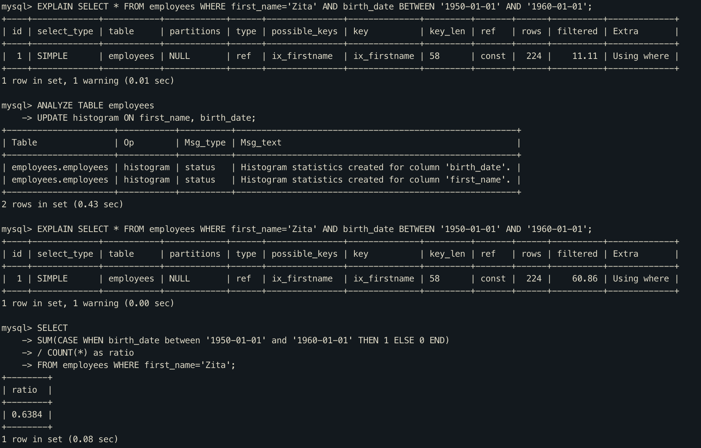

# 히스토그램의 용도

## 히스토그램 미수집과 수집시 예측치 결과

첫번째 쿼리결과를 보면, first_name이 `Zita`인 레코드중 11.11%정도만 birth_date 조건에 만족할것이라고 예측했다.

두번째 쿼리에서 first_name과 birth_date에 대한 히스토그램을 수집했고, 다시 쿼리를 돌려보면 60.86%가 만족할것이라고 예측했음을 확인할 수 있다.

마지막에 실제 비율을 계산한 쿼리 결과를 보면, 히스토그램 수집시 더 정확한 예측을 할수 있음을 확인할 수 있다.