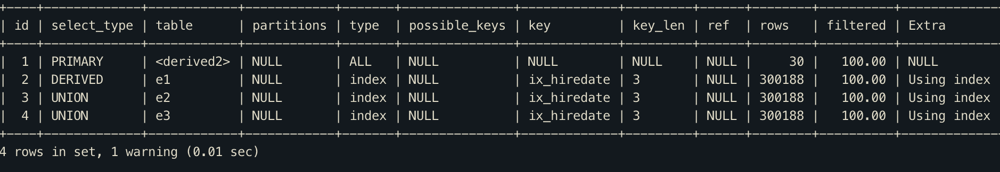

# UNION

``` mysql
mysql> EXPLAIN
    -> SELECT * FROM (
    -> (SELECT emp_no FROM employees e1 LIMIT 10) UNION ALL
    -> (SELECT emp_no FROM employees e2 LIMIT 10) UNION ALL
    -> (SELECT emp_no FROM employees e3 LIMIT 10)) tb;
```




- UNION으로 결합하는 단위 SELECT 쿼리 가운데 첫번째 테이블은 쿼리 결과들을 모아서 저장하는 임시테이블로 DERIVED로 표시되고, 나머지 테이블은 UNION으로 표시

