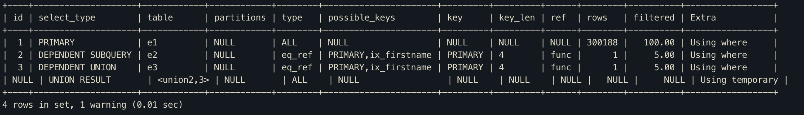

# DEPENDENT UNION

- UNION 또는 UNION ALL을 사용하면서 외부 쿼리에 의해 영향을 받는경우, 표시됨.
- 아래 예제의 경우 IN 내부의 서브 쿼리를 먼저 처리하지 않고, 외부의 employees 테이블을 먼저 읽은 다음 서브쿼리를 처리하는데 이때 서브 쿼리 실행이 외부 쿼리에 영향을 받는다.

``` mysql
mysql> EXPLAIN
    -> SELECT *
    -> FROM employees e1 WHERE e1.emp_no IN (
    -> SELECT e2.emp_no FROM employees e2 WHERE e2.first_name='Matt'
    -> UNION
    -> SELECT e3.emp_no FROM employees e3 WHERE e3.first_name='Matt'
    -> );
```

