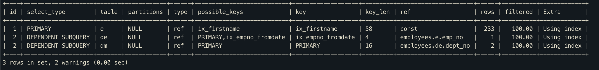

# DEPENDENT SUBQUERY

- 서브쿼리가 바깥쪽 SELECT 쿼리에서 사용된 칼럼을 사용하는 경우
- 다음 쿼리와 같이 안쪽 서브쿼리 결과가 바깥쪽 SELECT 쿼리의 결과에 의존적이기 때문에 select_type이 DEPENDENT SUBQUERY로 표시됨.

```mysql
EXPLAIN
SELECT e.first_name,
  (SELECT COUNT(*)
  FROM dept_emp de, dept_manager dm
  WHERE dm.dept_no=de.dept_no AND de.emp_no=e.emp_no) AS cnt
FROM employees e
WHERE e.first_name='Matt';
```




