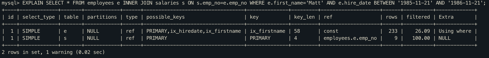

# 컨디션 팬아웃(condition_fanout_filter)

`condition_fanout_filter` 옵션은 기본적으로 활성화 되어있는데, 이 옵티마이저 스위치는 필터링된 레코드수를 정확하게 예측하는데 사용된다.

아래 쿼리의 실행 계획을 보면, filtered 값이 26.09로 되어 있는데, 이 뜻은 first name이 Matt인 레코드중에서 hire_date 조건을 만족하는 레코드는 26.09%가 될것이라고 예측한것을 의미한다.

## 옵티마이저가 조건을 만족하는 레코드의 비율검색 가능조건

- WHERE 조건절에 사용된 칼럼에 대해 인덱스가 있는 경우
- WHERE 조건절에 사용된 칼럼에 대해 히스토그램이 존재하는 경우

## 주의사항

condition_fanout_filter 최적화 기능을 활성화하면 실행 계획 수립에 더많은 컴퓨팅 자원이 들어가므로, 전체적인 성능에 영향은 없을지 테스트해보는것이 좋다.

