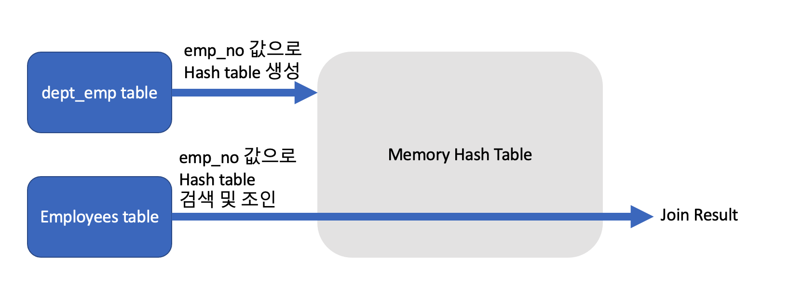
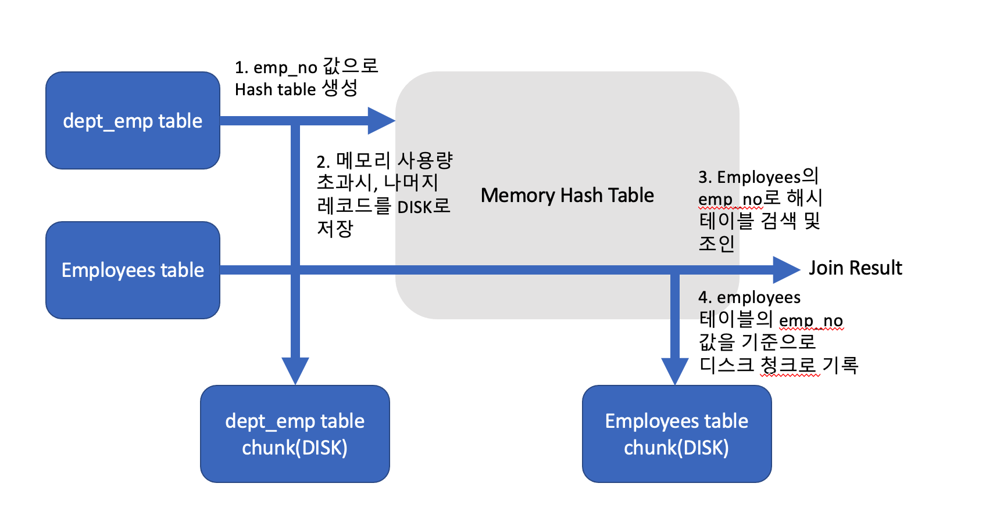
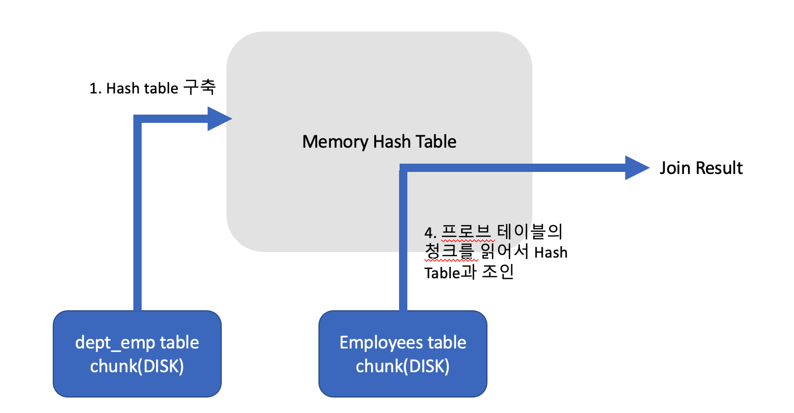

# 해시 조인(hash_join)

## 해시조인 vs 중첩 루프 조인

해시 조인 : Best Throughput이 response time보다 중요한 경우 사용 -> 전체 조인이 끝나는 소요시간은 짧지만, 첫번째 조인 레코드를 찾기까지 시간이 오래걸릴 수 있다.

중첩 루프 조인 : Throughput 보다 response time이 중요한 경우 사용 -> 전체 조인이 끝나는 시간은 길지만, 첫번째 조인 레코드를 찾기까지 시간이 짧음.


## 동작방식

``` mysql
SELECT * 
FROM employees e INNER JOIN dept_emp de
ON de.emp_no=e.emp_no AND de.from_date=e.hire_date
```

여기서 Hash table 생성에 사용되는 테이블을 빌드 테이블이라 부르고, 나머지 테이블들을 프로브 테이블이라고 부른다.

빌드 테이블은 레코드 건수가 적은 테이블이 주로 선정되며, 위 경우는 dept_emp 테이블이라고 가정한다.

- 메모리에서 모두 처리 가능한 경우 해시조인

  

- 메모리에서 모두 처리 못하는 경우

  1. 조인된 레코드들이 조인버퍼크기를 초과하는 경우, 메모리 사용량 초과된 빌드 테이블의 나머지 레코드 DISK로 저장, 프로브 테이블을 읽을때 마다 DISK로 기록

​	

2. DISK에 저장된 빌드 테이블을 읽어서 Hash table 구축후, 프로브 테이블을 읽어서 조인

   