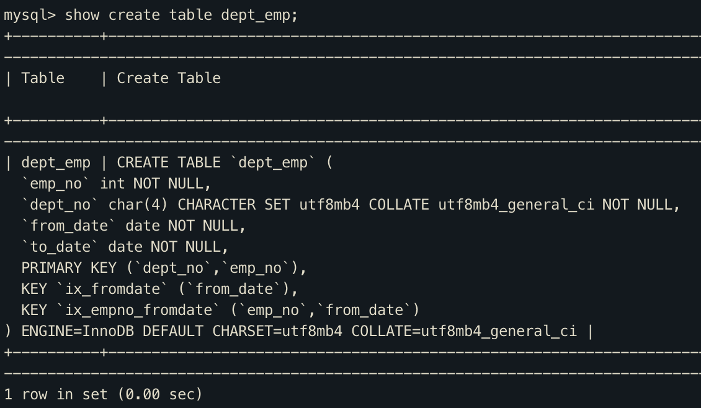
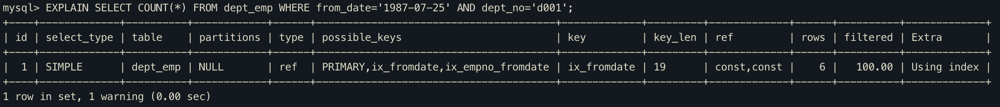
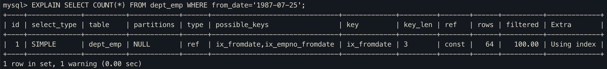

# 인덱스 확장(use_index_extensions)

> InnoDB 스토리지 엔진을 사용하는 테이블에서 세컨더리 인덱스에 자동으로 추가된 프라이머리 키를 활용할 수 있게 할지 결정하는 옵션

다음과 같이 프라이머리 키와 세컨더리 인덱스를 갖는 `dept_emp` 테이블이 있다고 가정하자.

세컨더리 인덱스는 데이터 레코드를 찾아가기 위해 프라이머리 키인 dept_no와 emp_no 칼럼을 순서대로 포함한다. 최종적으로 ix_fromdate 인덱스는 (from_date, dept_no, emp_no) 조합으로 인덱스를 생성한 것과 흡사하게 동작하게 된다.

예전 MySQL 버전에서는 세컨더리 인덱스에 자동으로 추가되는 프라이머리 키를 제대로 활용하지 못했지만 업그레이드 된 버전(정확히 언제 버전부터인지는 책에 나와있지 않음)부터는 옵티마이저가 `ix_fromdate` 인덱스의 마지막에 (dept_no, emp_no) 칼럼이 숨어있다는 것을 인지하고 실행계획을 수립한다.

아래 쿼리를 보면 `key_len` 칼럼 값이 19바이트 인것으로 보아 from_date(3바이트), dept_emp(16바이트) 까지 사용한것을 알수 있다.

반면 아래와 같이 dept_no 조건을 생략하면 `key_len` 값이 3바이트 인것으로 보아 from_date만 사용한것을 알수 있다.

