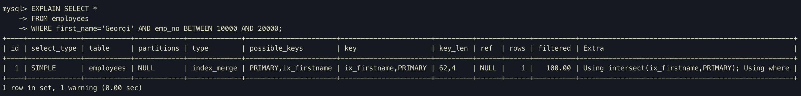

# 인덱스 머지 - 교집합(index_merge_intersection)

먼저 아래 쿼리의 실행 결과를 보면, Extra 칼럼에 "Using intersect" 라고 표시된 것을 볼수 있다.

즉 쿼리가 여러 인덱스를 각각 검색해서 그 결과의 교집합만을 반환했다는 뜻이다.

여기서 옵티마이저가 2개의 인덱스를 모두 사용한 이유가 무엇일까?

먼저 first_name이 `Georgi` 인 레코드 건수는 253 건이고, `emp_no BETWEEN 10000 AND 20000` 조건에 부합하는 레코드 건수는 10000 건이다.

그런데 `first_name='Georgi' AND emp_no BETWEEN 10000 AND 20000` 조건에 부합하는 레코드 건수는 14건뿐이다.

그러므로 옵티마이저는 각 인덱스를 검색해 두 결과의 교집합만을 반환한것이다.