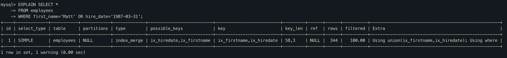

# 인덱스 머지 - 합집합(index_merge_union)

인덱스 머지의 'Using union'은 WHERE 절에 사용된 2개 이상의 조건이 각각의 인덱스를 사용하되 OR 연산자로 연결된 경우 사용되는 최적화다.

다음 쿼리의 실행 계획을 보면, 'Using union' 최적화를 사용한것을 알수 있다.

쿼리의 실행계획에서 "Using union(ix_firstname, ix_hiredate)" 라고 표시가 된것은 ix_firstname 인덱스 검색 결과와 ix_hiredate 검색 결과를 Union 알고리즘으로 병합했다는 의미이다.

위에서 두 결과 집합을 합집합하여 중복 레코드를 제거하려면 결과집합을 정렬해야 할터인데 실행 계획에 정렬작업을 했다는 흔적은 없는데, 그 이유가 무엇일까?

이유는 두 결과 집합은 PK로 정렬돼 있기 때문에, 두 집합에서 하나씩 가져와서 서로 비교하면서 프라이머리 키인 emp_no 칼럼의 값이 중복된 레코드들을 정렬 없이 걸러낼 수 있다는 것이다.

이 알고리즘을 Priority Queue라고 한다.