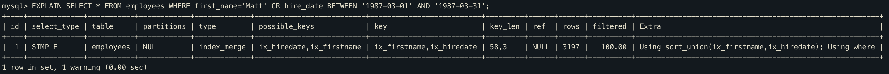

# 인덱스 머지 - 정렬 후 합집합(index_merge_sort_union)

만약 인덱스 머지 작업도중에 결과정렬이 필요한 경우 MySQL서버는 `Sort union` 알고리즘을 사용한다.

다음 쿼리의 경우, sort_union 알고리즘이 사용된것을 알수 있다.

위의 쿼리는 앞선 merge_union 예시와 달리, `hire_date BETWEEN '1987-03-01' AND '1987-03-31'` 조건에대한 레코드 결과를 살펴보면 emp_no에 대해서 정렬이 되어있지 않다.

따라서 중복제거를 위해서 우선순위 큐를 사용하는것은 불가능하므로 emp_no에 대해서 정렬하는 과정이 필요하다.