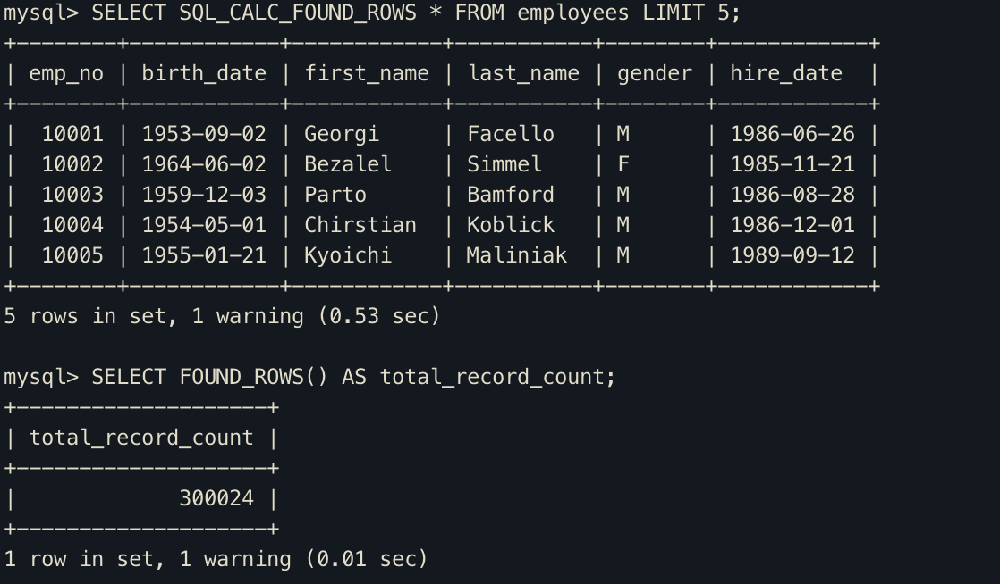

# SQL_CALC_FOUND_ROWS




- SQL_CALC_FOUND_ROWS 힌트가 포함된 쿼리의 경우에는 LIMIT을 만족하는 수만큼의 레코드를 찾았다고 하더라도 끝까지 검색을 수행
- FOUND_ROWS() 라는 함수를 사용해서 LIMIT을 제외한 조건을 만족하는 레코드가 몇 건이었는지 알수 있음.


일반적으로 위 힌트는 테이블 전체 탐색을 유도하기 때문에 아래와 같이 변경하는것이 성능상 이점이 있다.

``` mysql
mysql> SELECT COUNT(*) FROM employees WHERE first_name='Georgi';
mysql> SELECT * FROM employees WHERE first_name='Georgi' LIMIT 0, 20;
```

위 쿼리는 먼저 ix_first_name 인덱스를 레인즈 스켄하여 first_name이 Georgi인 레코드 수를 카운팅한다. 이때 실제 레코드 데이터가 필요한 것은 아니므로 랜덤 디스크 IO가 발생하지 않는다.

그리고 두번째 쿼리에서는 실제 레코드를 읽게되는데, LIMIT 0,20 조건이 있으므로 20번의 랜덤 디스크 IO만 발생한다.


일반적으로는 SQL_CALC_FOUND_ROWS보다는 레코드 카운터용 쿼리와 데이터를 조회하는 쿼리는 분리하는 것이 더 효율적이다.